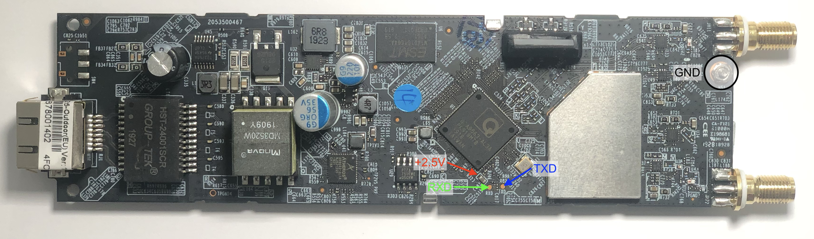

# OpenWrt on the TP-Link EAP225-Outdoor

The [TP-Link EAP225-Outdoor](https://www.tp-link.com/en/business-networking/outdoor-ap/eap225-outdoor/) is a simple, yet robust, powerful, and waterproof outdoor wifi access point. This meta-repository serves as documentation on how to run [OpenWrt](https://openwrt.org) on the EAP225-Outdoor.

## Serial Console

The factory firmware only allows flashing signed firmware images. Therefore, a serial console is required. The enclosure can be opened by removing two screws on the antenna mounts:


The PCB slides out of the enclosure once the screws and sealing are removed. The TX- and RX-Lines are conveniently exposed on the PCB. **The voltage level of the lines is 2.5V!** Therefore, a serial interface supporting this logic level like the [µArt](https://uart-adapter.com) is required otherwise the SOC might get damaged! 2.5V supply voltage can be found on the side closer to the SOC of one of the bigger capacitors C483 close to the SOC. The easiest way to get GND is the shielding:



After powering up the access point, the bootloader and firmware log will be transmitted over the serial line. The U-Boot console is not locked and can be accessed by hitting **CTRL+B**.

## Building OpenWrt

Instructions on how to build an OpenWrt image is out of the scope of this document. The neceesary pathces are available in the [main repository](https://github.com/abusse/openwrt). Building the firmware image is straight forward by selecting `"Atheros AR7xxx/AR9xxx"` as _Target System_ and `"TP-LINK EAP225 Outdoor v1"` as _Target Profile_.

## Testing the OpenWrt Image

Before flashing the firmware image, testing is recommended. Besides the build firmware image, a TFTP server is required:

```bash
ath> setenv ipaddr XXX.XXX.XXX.XXX (optional 192.168.1.1 by default)
ath> setenv serverip XXX.XXX.XXX.XXX (optional 192.168.1.10 by default)
ath> tftp 0x81000000 openwrt-ar71xx-generic-eap225od-v1-initramfs-kernel.bin
ath> bootelf
```

This should load the image from the TFTP server and boot the firmware image.

## Flashing the OpenWrt Image

There are two ways to flash the OpenWrt image permanently:

### Flashing via Booted OpenWrt Image

The booted test image can flash an OpenWrt image through the web interface. The procedure is the same as updating an already installed OpenWrt image.

### Flashing via U-Boot

Flashing is also possible directly from U-Boot without booting an OpenWrt image:

```bash
ath> setenv ipaddr XXX.XXX.XXX.XXX (optional 192.168.1.1 by default)
ath> setenv serverip XXX.XXX.XXX.XXX (optional 192.168.1.10 by default)
ath> tftp 0x81000000 openwrt-ar71xx-generic-eap225od-v1-squashfs-sysupgrade.bin
ath> erase 0x9f040000 +0xd80000
ath> cp.b $fileaddr 0x9f040000 $filesize
```